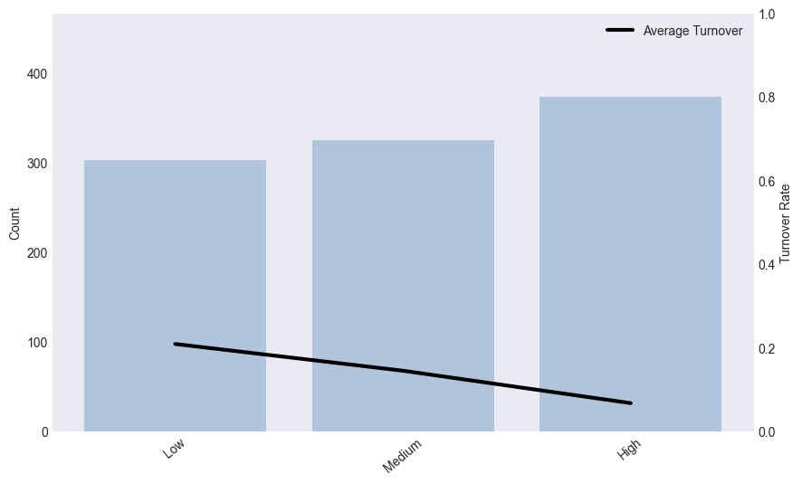
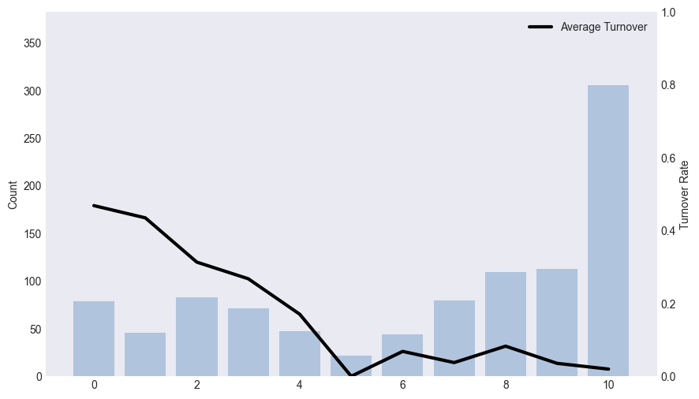

<h1 style="text-align:center;">
Unveiling Employee Retention Insights:
 
Predicting Turnover and Evaluating Employee Risk Levels
 </h1>

## Overview
This project aims to analyze and predict employee turnover at a fictitious company. A Jupyter notebook leverages data visualizations and machine learning techniques to provide insights into factors contributing to turnover and to create a predictive model to assess employee risk level.

  

## Data
The dataset used in this analysis is fictitious and includes information on employee characteristics, performance, and turnover status. The features are used to train and evaluate the predictive model.

  

## Exploratory Data Analysis
### Employee Turnover
Out of the 1,000 employees in the dataset, **`135`** left the company giving an overall turnover rate of **`13.5%`**

 

### Average Turnover Rate By Feature

#### Department
There are **`10`** unique departments and there isn't a large difference between number of employees in each department. The turnover rate is relatively stable across all departments, with slight peaks in **`HR`** and **`Sales`**.

 

#### Tenure
The decreasing turnover rate as the tenure classification moves from “Low” to “High” may indicate that the company is doing a **`good job of retaining long-term employees but struggling with newer employees`**.

 

#### Employee Is A Mentor
Employees who are not mentors (N) have a higher count but also a higher turnover rate than those who are mentors (Y). This suggests that **`being a mentor could potentially be correlated with lower turnover rates`**.

 

#### Employee Is A Mentee
Similar to whether an employee is a mentor, employees who are not mentees (N) have a higher count but also a higher turnover rate than those who are mentees (Y). This suggests that **`being a mentee could potentially be correlated with lower turnover rates`**.

 

#### Fully Remote
There are significantly more employees in the office versus fully remote. The higher turnover rate for those who are fully remote (Y) may indicate that **`remote work could potentially be correlated with higher turnover rates`**.

 

#### Number of Surveys Taken
Around **`30%`** of employees have taken all 10 surveys and there is a **`general decline in turnover rate as number of surveys taken increases`**. 

 

#### Employee Completed Training
The majority of employees have completed training but the high turnover rate for those that didn't may indicate that **`completing training could potentially be correlated with lower turnover rates`**. 

 

#### Salary Relative To Peers
Employees with a low salary relative to their peers have a higher turnover rate, while those with medium and high salaries have lower turnover rates. This suggests that **`employees who are paid less compared to their peers might be more likely to leave the company`**.

 

#### Employee Received Bonus
The majority of employees received a bonus but the high turnover rate for those that didn't may indicate that **`receiving a bonus could potentially be correlated with lower turnover rates`**. 

 

#### Employment Classification
The majority of employees are full time but the high turnover rate for those that aren't may indicate that **`being full time instead of part time could potentially be correlated with lower turnover rates`**. 

 

#### Peer Recognition Awards
As the number of peer recognition awards an employee receives increases, the turnover rate generally decreases. This may indicate that **`employees who receive more awards might be more likely to stay at the company`**.

 

#### Team-Level Survey Job Satisfaction
A significant number of employees are very happy (Green), as indicated by the highest count. The teams with the **`happiest employees (Green) have the lowest turnover rate, while the unhappiest (Red) have a higher turnover rate`**.

  

## Building Machine Learning Models
Model building was performed in a series of steps.
> 1. Train the baseline models
> 2. Remove any redundant features and re-train the models
> 3. Tune hyperparameters and re-train the models

 

The table below shows each step's **`average cross-validated auc score`** by model. The cross-validated auc score is a metric used to assess performance of a model across multiple data subsets, offering an unbiased evaluation of its ability to distinguish between positive and negative instances. The score ranges from 0 to 1 where higher values closer to 1 indicate better performance and a score around 0.5 suggests performance is similar to random chance.

 

The **`Random Forest`** model outperformed the other models with a final average cross-validated auc score of **`0.90`**. This model was then used to make predictions on the un-seen test set and also showed strong performance with an auc score of **`0.88`**.

 

Shapley values were calculated to understand the relationship between each predictor and turnover, with higher values represented in red and lower values in blue. The most important feature for the final model is **`Team-Level Survey Job Satisfaction`**, where "Red" (1) signifies dissatisfaction and an increased likelihood of an employee departing from the company.

  

## Concluding Remarks
### Main Takeaways
**`135`** employees left the company giving an overall turnover rate of **`13.5%`**.

The company is doing a **`good job of retaining long-term employees but struggling with newer employees`**. There may be an opportunity to enhance the onboarding process and offer clear paths for career growth and development.

**`Employees that are more engaged tend to have a much lower turnover rate`**, as indicated by participation in mentor/mentee program, completing training, taking company surveys, and working in the office. The company should consider adding more opportunities like team building activities, leadership development, and networking events to boost engagement and decrease turnover.

**`High-performing, high-earning employees tend to have a much lower turnover rate`**, as indicated by salary relative to peers, receiving a bonus, and number of peer recognition awards. The company should consider encouraging regular performance feedback and training opportunities for employees that are not in the high-performing, high-earning category. **`The company should also consider using team-level job satisfaction surveys as an indicator for teams at risk for turnover`**.

 

### Potential Next Steps
As the company collects more data on its employees, **`the model can be enhanced using the additional data`**. The company could also explore collecting new data like years in current role, years with current manager, and years since last promotion.

The predictive model above can be used to assign each employee a "risk score" based on the predicted turnover such that **`each employee will be categorized as Low-Risk, Medium-Risk, and High-Risk`**.

The HR team can use these findings to **`implement new programs and opportunities to help lower overall turnover rate`** as well as place more emphasis on employees categorized as "High-Risk".